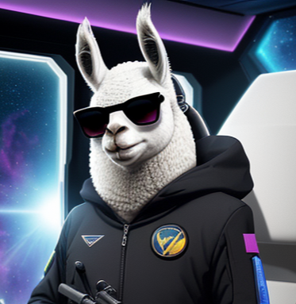

# Agent Llama007B: a Conversational AI Assistant



## Overview

AgentLlama007B is a powerful Conversational AI Assistant designed for natural language interactions and task automation. It leverages state-of-the-art language models and offers seamless integration with external tools and knowledge sources. Whether you need to engage in casual conversations or perform specific tasks, AgentLlama007B has you covered.

## Key Features

- **Natural Language Conversations**: Engage in human-like conversations powered by advanced language models like Anthropic's Claude.
- **Tool Integration**: Execute various tools, including image generation, web search, Wikipedia queries, and more, all within the conversation.
- **Persistent Memory**: Contextual knowledge is stored in a vector database, providing continuity and enhancing the conversational experience.
- **Modular Architecture**: Easily extend AgentLlama007B with additional skills and tools to suit your specific needs.

## Getting Started

To start using AgentLlama007B, follow these simple steps:

1. Install the required dependencies by running `pip install -r requirements.txt`.

2. Run the main Streamlit app:

```bash
streamlit run agent_llama_ui.py
```

3. Alternatively, you can integrate the agent into your Python code:

```python
from agent_llama import SmartAgent

agent = SmartAgent()

while True:
    user_input = input("You: ")
    response = agent.agent_generate_response(user_input)
    print("Bot:", response)
```

For more details on customization, model configuration, and tool parameters, refer to the code documentation.

## Implementation

AgentLlama007B's core logic is encapsulated in the `RBotAgent` class, which manages the conversational flow and tool integration. The knowledge base tool, `StorageRetrievalLLM`, uses persistent memory with a FAISS index of document embeddings. Various tools are provided, each encapsulating specific skills such as image generation and web search. The modular architecture allows easy replacement of components like the language model.

## Credits

This project was created by Salvatore Rossitto as a passion project and a learning endeavor. Contributions from the community are welcome and encouraged.

## License

AgentLlama007B is an open-source project released under the MIT license. You are free to use, modify, and distribute it as per the terms of the license.

---

Feel free to replace `insert_logo_image_link_here` with the actual link to your project's logo. This revised readme provides a more structured and user-friendly introduction to AgentLlama007B and makes it easier for users to get started.